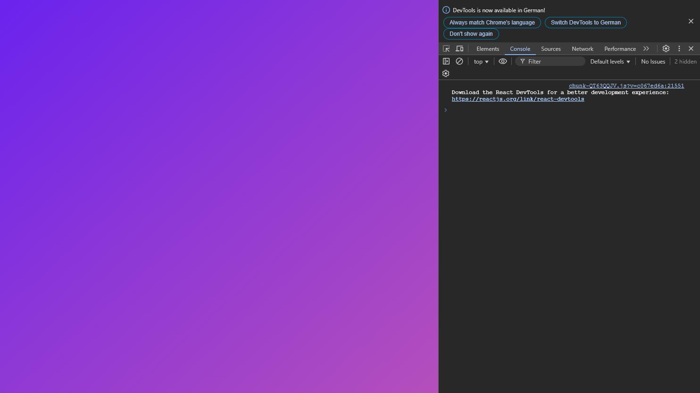

# Forging Electrons

## How to use

To start forging electrons, download the folder or fork the repo (I think downloading the folder is more straightforward because this repo is a mess at the moment).
Make sure you're in the `forging-electrons` folder then run `npm install` to install the necessary packages and then `npm start` to launch the application.
Feel free to reach out to me `@beeverone` on most social media platforms. You can also send me an email to `thebeeverone@gmail.com`.

## Process

I’ve spent the greater part of the last two weeks trying to figure out integrating `three.js` into an electron app. After hitting more walls than I can count, I finally summoned the courage to go further out of my comfort zone and try some technologies I wasn’t (still am not :) ) familiar with - `electron forge` and `react three fiber`.
This is the documentation of the process.

### Electron-Forge

The first step was setting up an app template using electron forge. For anyone who is unfamiliar at this point, electron forge is an all-in-one tool for packaging and distributing electron applications. Now that that’s out of the way, lets create a new app. I’ll be using the electron forge vite template (why? that’s what I’m familiar with)

```bash
npx create-electron-app@latest forging-electrons --template=vite
```

This should initialize your app and install the basic dependencies to get your app running. To test where we’re at to make sure everything initialized correctly, change directory to your app folder - `cd forging-electrons`, then run `npm start` to launch the app.


This is what my app looks like on first launch. I think the window is too small especially with dev tools open. To increase the window size, I’ll adjust the height and width of the main window in `forging-electrons/src/main.js` (the main process of the app). In order to see the changes you made, you need to restart the app by using `Ctrl + C` in the terminal or closing the app as you would other apps.


I’m not sure how easy it is to tell from both pictures that the second one is bigger but it is, trust me :).

### React

Here’s a list of packages that need to be added to the project so we can proceed:

- react ✔
- react-dom ✔
- material ui (@mui) ✔
- react-three/drei ✔
- react-three/fiber ✔
- types/three ✔
- three ✔

```bash
npm install --save react react-dom 
```

Running these first will install the latest versions of the packages. However, the current version of react and react-dom are 19.0.0 and as of today, React Three Fiber (R3F) version 8 is not compatible with react-19. Because of this, we need to remove the packages we installed and specify which version of react we want to install and that’ll be `18`.

```bash
npm uninstall react react-dom
```

```bash
npm install react@18 react-dom@18
```

Now we can proceed to installing the other dependencies:

```bash
npm install three @types/three @react-three/fiber @react-three/drei
```

```bash
npm install @mui/material @emotion/react @emotion/styled @fontsource/roboto @mui/icons-material
```

Now that all the necessary dependencies for the project are installed, we can relaunch the app and start adjusting and writing code.

### Code

In order to get rid of a security warning you’ll get in the console by default;


we need to add some instructions (CSP - Content Security Policy) to the `head` of the `index.html` file. A CSP is used to control what resources the app can load and execute.

```html
<meta
      http-equiv="Content-Security-Policy"
      content="script-src 'self'; object-src 'none';"
    />
```

This CSP basically tells the app to only allow scripts from within the app and block other elements. It’s probably a good time to adjust the `webPreferences` in the `main.js` file.

```javascript
const mainWindow = new BrowserWindow({
    width: 1500,
    height: 900,
    webPreferences: {
      nodeIntegration: false,//add this line
      contextIsolation: true,//and this line
      preload: path.join(__dirname, "preload.js"),
    },
  });
```

#### Resetting body styling

This is the next step I’m taking by editing the contents of the `forging-electrons\src\index.css` file. You can do this how you want, here’s how I did mine:

```css
body {
  font-family: -apple-system, BlinkMacSystemFont, "Segoe UI", Roboto, Helvetica,
    Arial, sans-serif;
  margin: 0; /* edit */
  padding: 0; /* edit */
}
```

#### index.html

I’m moving on to the  `forging-electrons\index.html` file now. Here I’m going to edit the title, create a container for my page (react) and also edit the script. By default, the script has it’s source set to `/src/renderer.js`, but that’s not going to work.
To have our page be rendered with react as intended, a new `renderer.jsx` file should be created in the same directory. You can also clear this part of the file.

```html
<h1>💖 Hello World!</h1>
<p>Welcome to your Electron application.</p>
```

Now this is what the body of my HTML looks like

```html
<body>
    <div id="root"></div>
    <script type="module" src="/src/renderer.jsx"></script>
  </body>
```

If you’re wondering why I’m not including the full code blocks, it’s because I don’t want to just bloat up this documentation. The whole app will be available on one of my GitHub repositories.

At this point, the app is completely empty;


The rest of this documentation might be blurry, as I myself don’t fully understand what some of my code is doing. I’ll do my best to explain what I can anyway

#### renderer.jsx

This might not be the most logical next step, but I want to tackle it with gradually increasing complexity.

Before I proceed, I will create all the necessary files now.

- App.jsx
- MonitorScene.jsx
Both of these files go in the `src` folder.
I will also add a public folder that has my monitor.obj as well as a HDR image I will be using for the environment later to the `forging-electrons` directory .

Next I include my imports and create a root variable that targets a DOM element with ID `root`.  `CssBaseline` normalizes the CSS across browsers. I have a feeling that using `CssBaseline` is sort of redundant because I already manually reset the `index.css` file. In my mind, I’m thinking about it as a fail safe.

```jsx
const root = createRoot(document.getElementById("root"));
root.render(
  <>
    <CssBaseline />
    <App />
  </>
);
```

#### MonitorScene.jsx

It starts to get pretty interesting here especially if you’re not familiar with `Three.js` or `React`. I’m not going to go into as much detail as I have up till now because it’s pretty complex and lengthy from here.

I first create a Rig function that adjusts the camera’s position to create the effect that the monitor is reacting to the pointer location.

After finishing my import statements, I decided it makes sense to switch to the `App.jsx` file because I want to see something rendered in my app. I don’t want to write a bunch of code and have to be looking for errors later. I’ll come back here when I’ve rendered some basic content in through the `App`.

Trying to import `MonitorScene` from `MonitorScene.jsx` will throw an error in the console because `App.jsx` can’t find a function inside the file. To fix this, I appended the code below to handle this error

```jsx
export default function MonitorScene() {
  return <Canvas>{/* Fake content */}</Canvas>;
}
```

##### After App.jsx

Now I came back here to build out the functions and objects I need for my scene. There’s not much to say besides the fact that I replaced `{/* Fake content */}` with actual content.

#### App.jsx

This file is what’s responsible for the content rendered in the application. To render a simple gradient background - which happens to be my app background, add this after your imports.

```jsx
export default function App() {
  return (
    <Box
      sx={{
        display: "flex",
        height: "100vh",
        background: "linear-gradient(to bottom right, #6a00f4, #b44ac0)",
      }}
    ></Box>
  );
}
```

Now it should look like this;



Now I’ll add a drawer and bunch of other elements for the app.
After a bunch of tinkering, I pretty pleased with where the app is now. I also understand what’s going on more but still won’t go into details much because my aforementioned reason.


Now I’m done with the `App.jsx` file (for now :). It looks identical to the gif above. Now to the `MonitorScene.jsx` file.

### Current State


This is where the app is. I’ll push all the work I’ve done to the repository so that the journey to this point is documented. I didn’t show it here but resizing the app window breaks the camera because I’m not handling window-resize event yet.

#### Resize Event

I’ve just learned that R3F automatically handles window resizing and one of the elements of my `MonitorScene` overrides this. This is the source of the conflict.

```react
export default function MonitorScene() {
 return (
  <Camera></Camera>
  <Stage
         intensity={1}
         environment="city"
         shadows={{ type: "accumulative", bias: -0.001, 
         intensity: Math.PI }}
         adjustCamera={true} // <-- conflict
      ></Stage>
 )
}
```

Setting `adjustCamera` to `false` should resolve the conflict.

```react
export default function MonitorScene() {
 return (
  <Camera></Camera>
  <Stage
         intensity={1}
         environment="city"
         shadows={{ type: "accumulative", bias: -0.001, 
         intensity: Math.PI }}
         adjustCamera={false} // solved
      ></Stage>
 )
}
```


### Moving Forward

I still plan to implement functionality into the buttons. I wanna take a short organizational break.
